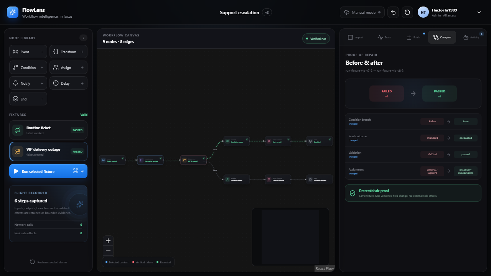
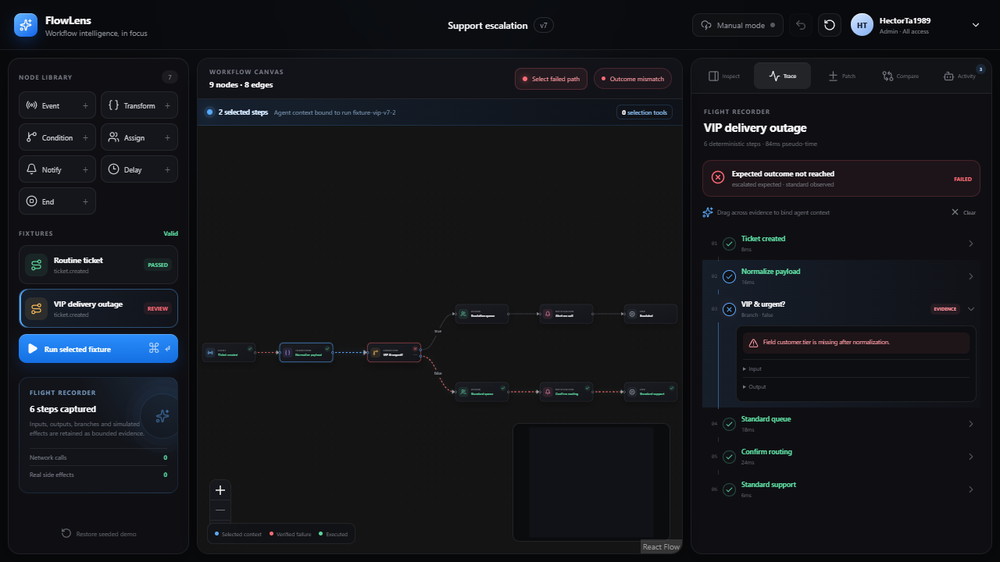

# FlowLens

> Workflow intelligence, in focus.

FlowLens is a selection-aware workflow flight recorder built for the WebMCP hackathon. An operations specialist can run a deterministic automation, select the exact failed path, and let a compatible browser agent inspect that bounded evidence without copying node IDs, payloads, or timestamps. The agent stages the smallest safe repair; the human approves it; FlowLens applies it once, reruns the same fixture, and proves the result with a before-and-after comparison.



Created by [HectorTa1989](https://github.com/HectorTa1989). Licensed under MIT.

## Why FlowLens is different

Most automation debuggers make the user translate visual context back into text. FlowLens turns the human's focus into a typed, temporary tool surface:

1. Select the normalization and condition trace steps.
2. Four selection-bound WebMCP tools register with immutable run, step, node, selection, and workflow versions captured in closure state.
3. Ask the browser agent: **“Why did this selected path fail? Fix it with the smallest safe change.”**
4. The agent reads deterministic evidence and previews a one-field patch.
5. FlowLens does not mutate anything until the human clicks **Approve patch**.
6. A single-use approval tool appears, applies the exact approved patch, reruns the fixture, and proves the branch changed.

The hero defect is intentionally subtle: normalization emits `customer.segment`, while the condition reads `customer.tier`. The VIP fixture therefore reaches the standard queue without throwing. The trace contains enough evidence to diagnose it.



## Product highlights

- Apple-inspired dark graphite interface with glassy chrome, crisp hierarchy, restrained color, and reduced-motion support.
- Interactive `@xyflow/react` workflow canvas with finite safe node types, connections, position persistence, selection synchronization, minimap, and executed-path animation.
- Deterministic simulator with true/false branches, typed trace steps, pseudo-time, cancellation, and simulated side effects only.
- Page, selection, approval, and conditional undo WebMCP lifecycles using `AbortController` cleanup.
- Strict JSON Schemas, internal executor validation, bounded outputs, version guards, and secret-like field redaction.
- Visual tool activity rail with registration, invocation, result, cancellation, affected entity, and diff evidence.
- Restricted patch DSL, non-mutating preview, visible diff, human approval, single-use five-minute token, apply, rerun, compare, and undo.
- Local persistence, invalid-draft-safe hydration, and one-click restoration of the seeded demo.
- Polar embedded Checkout Link paywall for Pro features.
- `HectorTa1989` local admin persona with every paid feature enabled.
- Manual mode remains complete and is labeled honestly when WebMCP is unavailable.

## Quick start

Requirements: Node.js 22+ and npm 10+.

```bash
npm install
copy .env.example .env.local
npm run dev
```

Open `http://127.0.0.1:5173`.

The default local persona is `HectorTa1989` with `admin` plan access, so patch preview, approval/application, comparison, and advanced history are immediately available. Use the account menu to switch to **Guest operator** and verify the Polar paywall.

### Polar configuration

Create a persistent Checkout Link in Polar, then set:

```dotenv
VITE_POLAR_CHECKOUT_URL=https://polar.sh/your-organization/checkout/your-link
```

For embedded checkout, add the development and production hosts under **Polar → Settings → Preferences → Embedding**. FlowLens appends `reference_id=flowlens-guest` and `theme=dark` to the configured Checkout Link. No Polar access token or secret belongs in this Vite client.

The local admin switch is intentionally a hackathon/demo bypass, not production authorization. A production version must authenticate the user on a trusted server and derive entitlements from signed Polar webhooks or verified customer state. See [SECURITY.md](SECURITY.md).

## Demo walkthrough

1. The workspace opens on **VIP delivery outage**, already recorded as an outcome mismatch.
2. Click **Select failed path**. The normalization and condition steps highlight on the trace and canvas.
3. In a compatible browser agent, ask: `Why did this selected path fail? Fix it with the smallest safe change.`
4. Expected calls:
   - `inspect_selected_execution`
   - `explain_selected_contract_mismatch`
   - `preview_fix_for_selected_failure`
5. Review `customer.tier → customer.segment` in the Patch tab.
6. Click **Approve patch**. Only now does `apply_approved_workflow_patch` register.
7. Let the agent apply the token, or click **Apply & rerun fixture** for the complete manual path.
8. The comparison proves `false → true`, `standard → escalated`, and `failed → passed`.
9. Click Undo to restore the original deterministic failure.

## Commands

| Command | Purpose |
| --- | --- |
| `npm run dev` | Start the Vite development server |
| `npm run typecheck` | Run strict TypeScript project checks |
| `npm test` | Run deterministic domain and WebMCP contract tests |
| `npm run build` | Create the production static bundle |
| `npm run preview` | Serve the production bundle locally |
| `npm run test:e2e` | Run the repair and Polar-gating Playwright journeys in system Chrome |

Verified on August 28, 2026:

- TypeScript: pass
- Vitest: 19/19 pass
- Playwright: 2/2 pass
- Production build: pass
- Real in-app WebMCP calls: diagnosis, preview, approval-scope registration, apply, and rerun pass

## Project structure

```text
FlowLens/
├─ .github/
│  └─ workflows/ci.yml              # typecheck, unit, build, and browser CI
├─ docs/
│  └─ screenshots/                  # Playwright-verified demo evidence
├─ public/
│  └─ _headers                      # tools permissions policy and hardening headers
├─ src/
│  ├─ app/
│  │  ├─ App.tsx                    # three-pane product composition
│  │  └─ store.tsx                  # typed reducer, commands, persistence, history
│  ├─ domain/
│  │  ├─ fixtures.ts                # stable hero workflow and two fixtures
│  │  ├─ patches.ts                 # preview, approval token, guarded apply, compare
│  │  ├─ path.ts                    # safe nested-field reads and writes
│  │  ├─ redaction.ts               # bounded untrusted-data sanitization
│  │  ├─ simulation.ts              # deterministic workflow flight recorder
│  │  ├─ types.ts                   # workflow, trace, patch, activity domain model
│  │  └─ validation.ts              # graph, port, reachability, config validation
│  ├─ features/
│  │  ├─ canvas/                    # React Flow canvas and synchronized path state
│  │  ├─ header/                    # workflow, WebMCP, undo, account controls
│  │  ├─ panel/                     # inspector, trace, patch, compare, activity tabs
│  │  ├─ paywall/                   # Polar checkout and Pro feature gate
│  │  └─ sidebar/                   # finite node library, fixtures, flight summary
│  ├─ test/setup.ts                 # browser-like Vitest environment
│  ├─ webmcp/
│  │  ├─ catalog.ts                 # shared tool names and descriptions
│  │  ├─ tools.ts                   # canonical schemas and executors
│  │  ├─ types.ts                   # current imperative API adapter types
│  │  └─ useWebMCP.ts               # dynamic scope registration and cleanup
│  ├─ main.tsx
│  └─ styles.css                    # Apple-inspired responsive visual system
├─ tests/e2e/hero.spec.ts           # complete repair and paywall journeys
├─ ARCHITECTURE.md
├─ EVALS.md
├─ SECURITY.md
├─ WEBMCP.md
├─ LICENSE
├─ playwright.config.ts
├─ vercel.json
└─ vite.config.ts
```

## WebMCP support

FlowLens uses the imperative `document.modelContext.registerTool()` API. It registers ten base page tools, four selection tools, one approval tool, and one conditional undo tool. Tool outputs are bounded to the security guidance's recommended size. The implementation follows the August 26, 2026 community draft and current Chrome guidance.

The implementation feature-detects `document.modelContext` and the optional `toolchange` event surface independently. This matters because a compatible agent surface may support registration/execution while omitting EventTarget-style listeners. See [WEBMCP.md](WEBMCP.md) for contracts and the compatibility adjustment.

## Deployment

FlowLens is a static Vite application with no network dependency for the hero journey.

### Vercel

```bash
npm run build
vercel --prod
```

`vercel.json` supplies the SPA rewrite and `Permissions-Policy: tools=(self)` header.

### Netlify or another static host

Publish `dist/`. The included `public/_headers` file supplies the same WebMCP permission and baseline hardening headers. Use HTTPS for both WebMCP and embedded Polar checkout.

No live URL is claimed in this repository because deployment credentials and a Polar organization Checkout Link were not provided.

## Documentation

- [Architecture](ARCHITECTURE.md)
- [WebMCP tool inventory](WEBMCP.md)
- [Security model](SECURITY.md)
- [Eval corpus and verified results](EVALS.md)

## Current limitations

- One intentionally polished CRM escalation workflow; no arbitrary code or real integrations.
- Local persistence only; no authentication, multiplayer, or backend.
- Manual node editing is deliberately finite. Free-form JavaScript and expressions are rejected by design.
- Polar checkout opens only after a real `VITE_POLAR_CHECKOUT_URL` is configured. Local purchases do not grant production entitlements because there is no trusted backend in this scoped build.
- WebMCP remains an evolving browser API. Unsupported browsers receive the complete manual product with truthful status.

## Primary references

- [WebMCP community specification](https://webmachinelearning.github.io/webmcp/)
- [Chrome WebMCP imperative API](https://developer.chrome.com/docs/ai/webmcp/imperative-api)
- [Chrome WebMCP security guidance](https://developer.chrome.com/docs/ai/webmcp/secure-tools)
- [Chrome WebMCP eval guidance](https://developer.chrome.com/docs/ai/webmcp/evals)
- [Polar embedded checkout](https://polar.sh/docs/features/checkout/embed)
- [Polar Checkout Links](https://polar.sh/docs/features/checkout/links)
